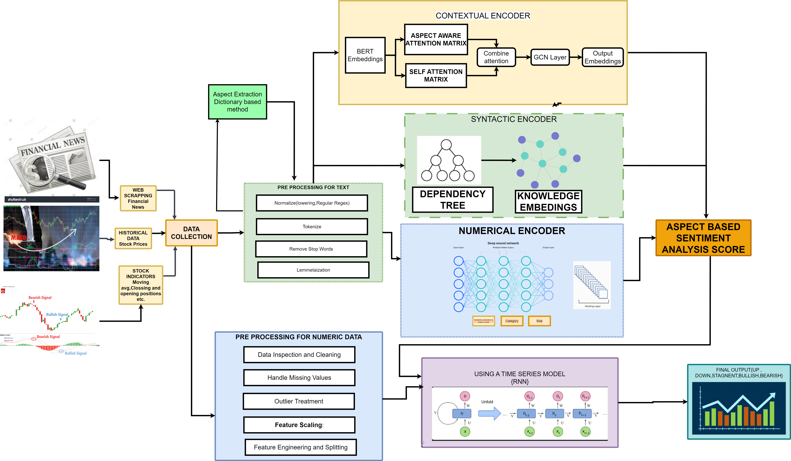

# Aspect-Based Stock Movement Prediction

## Introduction
Aspect-Based Stock Movement Prediction is a machine learning project that aims to predict stock price movements based on multiple aspects of financial data. The model uses both numerical data (such as stock prices, volumes) and textual data (such as news headlines, financial reports) to predict whether a stock's price will increase or decrease. The textual data is processed through Aspect-Based Sentiment Analysis (ABSA), allowing the model to assess how different aspects (e.g., company performance, market conditions) influence stock prices.
## Exec
1. First run the news extraction script which is web scraping for financial news headlines , we can set the range of years for the headline, additionally it has a notebook for news extraction for particular companies
2. These financial news collected company wise are passed to aspect extractor (exact working of the extractor is given in that particular folder{aspects})  
3. These collected news are stored in the folder financial_news , the news stored here is with respect to each company and their headlines along with aspects
4. These extracted news are sent to two different encoders , syntactic encoder which also include the preprocessing part for the text data and then generates a dependency tree from the new cleaned text and from that it derives the syntactic encoding
5. The cleaned data is also passed to the numerical encoding (specific working explained in the code notebook) which gives the numerical encoding for the text \
6. Results for each encoding is showed in the same respective notebook
7. the work on contextual encoder is still going on and it will be updated asap

## Key Features
Aspect-Based Sentiment Analysis (ABSA): Extract sentiment on various aspects (e.g., management, market trends) from financial news and reports.
Stock Price Prediction: Use both numerical and textual features to predict stock price movements.

The folder financial news contains the dataset we are using for the project.
### This is the overleaf link of the project report :https://www.overleaf.com/read/nckkjzsvtnvq#a0a5f0
